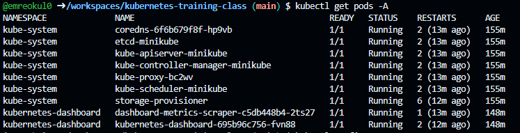
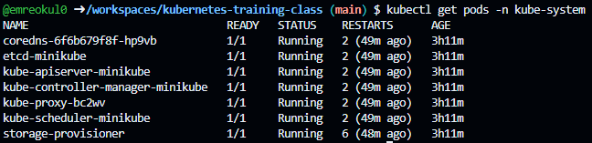
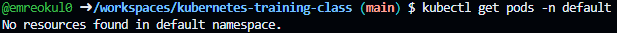
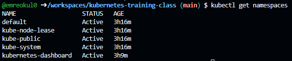

# Kubectl Commands

```bash
kubectl get pods -A
```



```bash
kubectl get pods -n kube-system
```



```bash
kubectl get pods -n default
```



```bash
kubectl get namespaces
```



```bash
kubectl config get-contexts
```


