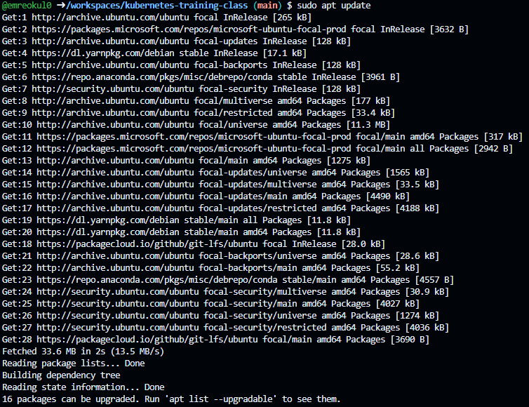
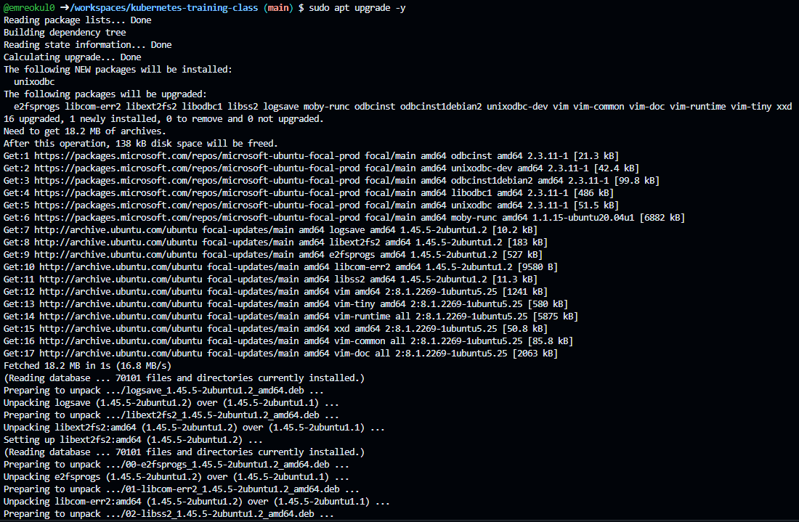
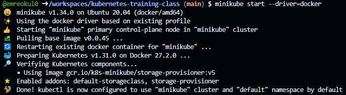
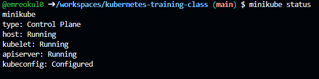
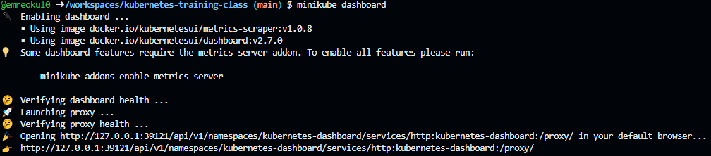
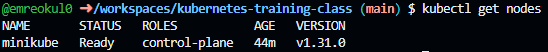
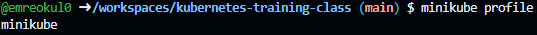
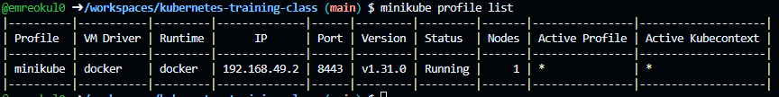

# Minikube Start

## Steps to Install Minikube

1. **Update and Upgrade the System**:
   Before proceeding, it's good practice to update the package lists and upgrade installed packages:

   ```bash
   sudo apt update && sudo apt upgrade -y
   ```

   

   

2. **Start Minikube with Docker Driver**:
   To start Minikube using Docker as the driver, run the following command:

   ```bash
   minikube start --driver=docker
   ```

   

3. **Check Minikube Status**:
   Verify that Minikube is running correctly:

   ```bash
   minikube status
   ```

   

4. **Access the Minikube Dashboard (Optional)**:
   Minikube provides a dashboard for visual management. To launch it, run:

   ```bash
   minikube dashboard
   ```

   

5. **Using kubectl with Minikube**:
   You can now use `kubectl` to manage your Minikube cluster. For example, check the nodes in your cluster with:

   ```bash
   kubectl get nodes
   ```

   

6. **Minikube Profile Info Command:**

   To get more detailed information about the cluster, you can use the `minikube profile` command to see the profile details.

   ```bash
   minikube profile
   ```

   

   This command gives more details about the profile, including the driver in use.

7. **Minikube Profile List Command:**

   The `minikube profile list` command is used to display a list of all Minikube profiles that exist on your machine. A profile in Minikube represents a separate Kubernetes cluster, allowing you to manage multiple clusters with different configurations.

   ```bash
   minikube profile list
   ```

   

   This command provides a table that includes the following information for each profile:

      - **Profile Name**: The name of the Minikube profile.
      - **Status**: The current state of the profile (e.g., running, stopped).
      - **Kubernetes Version**: The version of Kubernetes running in the profile.
      - **Node Information**: The details of the nodes, such as driver and status.
