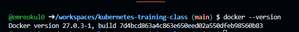
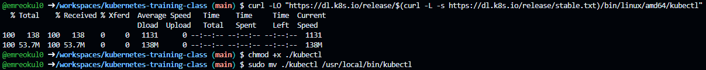
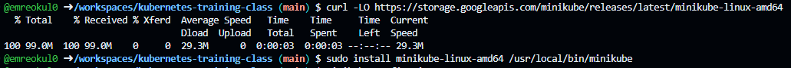

# Installations in GitHub Codespaces

## Prerequisites

Ensure you have the following installed in your Codespace:

1. **Docker**: Minikube uses Docker to create a virtual machine. You can check if Docker is installed by running:

   ```bash
   docker --version
   ```

   

2. **kubectl**: The command-line tool for managing Kubernetes clusters. Install it using the following command:

   ```bash
   curl -LO "https://dl.k8s.io/release/$(curl -L -s https://dl.k8s.io/release/stable.txt)/bin/linux/amd64/kubectl"
   chmod +x ./kubectl
   sudo mv ./kubectl /usr/local/bin/kubectl
   ```

   

3. **Minikube**: Install Minikube with the following command:

   ```bash
   curl -LO https://storage.googleapis.com/minikube/releases/latest/minikube-linux-amd64
   sudo install minikube-linux-amd64 /usr/local/bin/minikube
   ```

   
